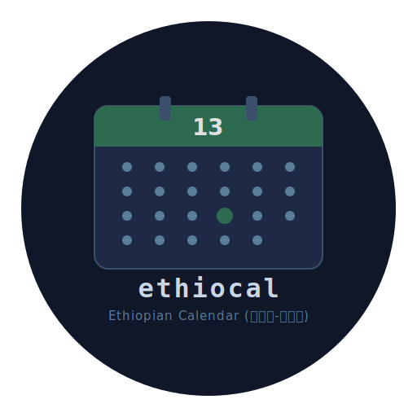

<p align="center">

</p>
<h1 align="center"><a href="https://pkg.go.dev/github.com/yinebebt/ethiocal">Ethiocal — Ethiopian Calendar (ባሕረ-ሐሳብ)</a></h1>

[](https://pkg.go.dev/github.com/yinebebt/ethiocal)
[](https://github.com/yinebebt/ethiocal/actions/workflows/ci.yml)
[](https://goreportcard.com/report/github.com/yinebebt/ethiocal)

## Description

Ethiocal is an Ethiopian calendar (ባሕረ-ሐሳብ) tool for retrieving fasting and holiday dates based on the
[EOTC](https://www.ethiopianorthodox.org/) calendar, and converting between Ethiopian and
Gregorian dates. Ethiopia follows its own calendar with 13 months (twelve 30-day months
plus a 5- or 6-day 13th month).

### Features

* **GUI desktop app** — launch with no arguments for a graphical interface.
* **CLI** — subcommands for scripting and terminal use.
* **HTTP API** — run as a server for integration with other services.
* Get Ethiopian fasting and religious festival dates for a specific year.
* Convert Ethiopian dates to Gregorian dates and vice versa.

## Installation

### Download a binary (no Go required)

Pre-built binaries are available on the [Releases](https://github.com/yinebebt/ethiocal/releases) page. Pick your platform:

| Platform | Download |
| --- | --- |
| macOS (Apple Silicon) | `curl -Lo ethiocal.zip https://github.com/yinebebt/ethiocal/releases/latest/download/ethiocal-macos-arm64.app.zip && unzip ethiocal.zip` |
| macOS (Intel) | `curl -Lo ethiocal.zip https://github.com/yinebebt/ethiocal/releases/latest/download/ethiocal-macos-amd64.app.zip && unzip ethiocal.zip` |
| Linux (x86_64) | `curl -Lo ethiocal.tar.xz https://github.com/yinebebt/ethiocal/releases/latest/download/ethiocal-linux-amd64.tar.xz && tar xJf ethiocal.tar.xz` |
| Windows (x86_64) | `curl -Lo ethiocal.zip https://github.com/yinebebt/ethiocal/releases/latest/download/ethiocal-windows-amd64.exe.zip && unzip ethiocal.zip` |

### Install with Go

```bash
go install github.com/yinebebt/ethiocal@latest
```

### Build from source

```bash
git clone https://github.com/yinebebt/ethiocal.git
cd ethiocal
go build -o ethiocal .
```

> **Note:** Building requires a C compiler and OpenGL headers because Fyne uses
> CGO. On Ubuntu/Debian: `sudo apt-get install libgl1-mesa-dev xorg-dev`.
> macOS and Windows have these out of the box.

## Usage

### GUI (default)

Run `ethiocal` with no arguments to launch the desktop app:

```bash
ethiocal
```

The GUI provides two tabs:

* **Date Converter** — pick a direction (Gregorian → Ethiopian or Ethiopian → Gregorian), enter a date, and convert.
* **Bahire-Hasab** — enter an Ethiopian year to view all fasting and festival dates.

### CLI

```bash
# Get religious dates for Ethiopian year 2017
ethiocal bahir 2017

# Convert Gregorian date to Ethiopian (year month day as separate args)
ethiocal convert gtoe 2025 2 2

# Convert Ethiopian date to Gregorian
ethiocal convert etog 2017 5 25
```

### HTTP Server

```bash
ethiocal --server
```

Starts the API on port `8080` (override with the `PORT` environment variable).

| Endpoint | Description |
| --- | --- |
| `GET /api/bahir/{year}` | Bahire-Hasab calendar for the given Ethiopian year |
| `GET /api/gtoe/{date}` | Convert Gregorian to Ethiopian (`YYYY-MM-DD`) |
| `GET /api/etog/{date}` | Convert Ethiopian to Gregorian (`YYYY-MM-DD`) |

### As a Go library

```go
import (
    "github.com/yinebebt/ethiocal/bahirehasab"
    "github.com/yinebebt/ethiocal/dateconverter"
)

// Get festivals for Ethiopian year 2017
festival, err := bahirehasab.BahireHasab(2017)

// Gregorian → Ethiopian
etDate, err := dateconverter.Ethiopian(2025, 2, 2)

// Ethiopian → Gregorian
gregDate, err := dateconverter.Gregorian(2017, 5, 25)
```

## License

See [LICENSE](LICENSE).
